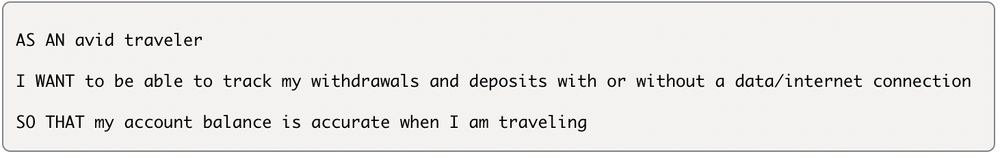
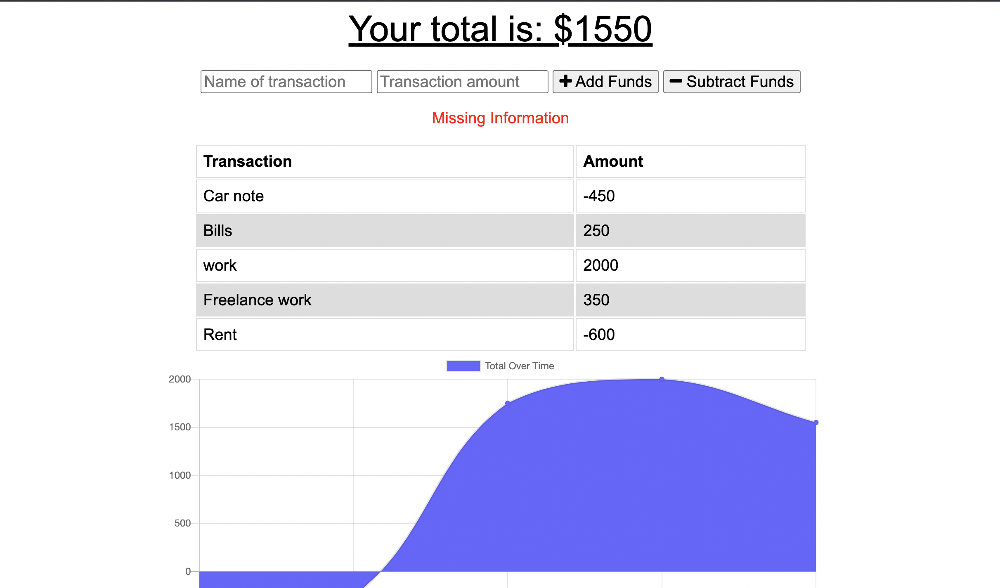

# budget-tracker

## Table of Contents
- User Story
- Description
- Deploy link
- Tools

## User Story 

## Description
Giving Users a fast & easy way to track there money/financial information, by allowing them to acces to that money at any time. Having offline functionality is parammount to a user success in any situation.

## Deploy link

## Screenshot 

## Tools
- Javascript ES6
- Node.js
- Express.js
- Mongoose
- IndexedDB
- Service Worker